## What it is

agent-flow is a free web page that runs on your own computer. Open it in your browser at http://127.0.0.1:3001 (an address that only your own computer can open; 3001 is the number the page answers on) while Claude Code is working, and you see a dark screen with a glowing hexagon. That hexagon is your Claude Code session. When the session hands a job to a subagent (a second Claude that does 1 task and reports back), a second hexagon appears and a line is drawn between them. Every tool call, such as reading a file or running a command, pops up as a small card beside the agent that made it.

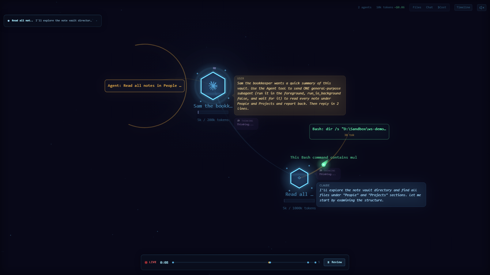

Along the top of the page are tabs, 1 per Claude Code session running on your computer. Each tab is titled with the first words of that session's opening message. Top right shows how many agents are running, an estimate of tokens used (tokens are the units Claude's usage is counted and billed in) and an estimated cost. Along the bottom is a timeline with a LIVE marker and a Review button that replays what happened. There is also a sound button in the top right corner, which mutes the page's small sound effects.

agent-flow was written by another developer and published free, with its code open for anyone to read and change (the Apache 2.0 licence; code at github.com/patoles/agent-flow). It is listed as `agent-flow-app` on npm, the public store of Node.js programs, version 0.9.1 checked on 2026-09-22. It also comes as an add-on for the VS Code code editor. Our download does not contain agent-flow. It contains 5 small Python scripts: an installer (`install.py`), a start-and-stop script (`start.py`), 2 checking scripts (`check_hooks.py` and `cleanup.py`) and `guard.py`, a small program that sits between agent-flow and your browser. Beside them are `common.py`, the shared code the 5 scripts use, and 1 small JavaScript file, `only_this_computer.js`, which makes agent-flow refuse requests from other websites. Together they set agent-flow up safely, because agent-flow installed on its own, unchanged, had faults on Ashley's own PC that kept coming back from 2026-06-12 to 2026-09-16. It also has 1 fault that happens on a Mac too: it can throw away your Claude Code settings file and everything in it.

This is piece 1 of 4 in the agent workspace. Install them in order: 1 agent-flow, 2 FleetView, 3 ProjectForge, 4 Jeeves. Each one also works on its own.

### Words used in this guide

| Word | What it means here |
|---|---|
| Session | 1 conversation with Claude Code, running in 1 terminal window. |
| Subagent | A second Claude that your session starts to do 1 job and report back. |
| Tool call | 1 action Claude takes, such as reading a file or running a command. |
| Token | The unit Claude's usage is counted in. 4 tokens are roughly 3 words. |
| Hook | A command Claude Code runs by itself every time a given event happens, such as a tool about to run. Hooks are listed in `settings.json`. |
| Terminal | The Terminal app on your Mac: the text window where you type commands. |
| Server | The agent-flow program running in the background on your computer, which draws the page. |
| 127.0.0.1 and localhost | 2 ways of writing "this computer". An address that starts with either of them opens only on your own computer. |
| Port | The number after the colon in an address such as http://127.0.0.1:3001. It picks out which program on your computer answers. In this set of 4: agent-flow 3001, FleetView 3010, ProjectForge 3020, Jeeves 4040. |
| Node.js, npm, npx | Node.js runs programs written in JavaScript; npm is its public store of programs; npx downloads a program from npm and runs it. |
| settings.json | Claude Code's settings file, in the `.claude` folder inside your home folder. |
| Repo | A project's folder of code, kept on GitHub. The git clone command copies it to your computer. |
| Watch folder | The folder agent-flow listens to; only sessions started inside it appear. |
| Exit code | The number a program hands back when it finishes; 0 means all went well. |
| `~` | Short for your home folder, the folder with your name and the house picture in Finder's sidebar. `~/CRM` is the folder called CRM inside it. |

## Why you would want it

When you run agents, most of the work is invisible. You type a request and later an answer arrives. You do not see which subagents were called, in what order, or which files they opened.

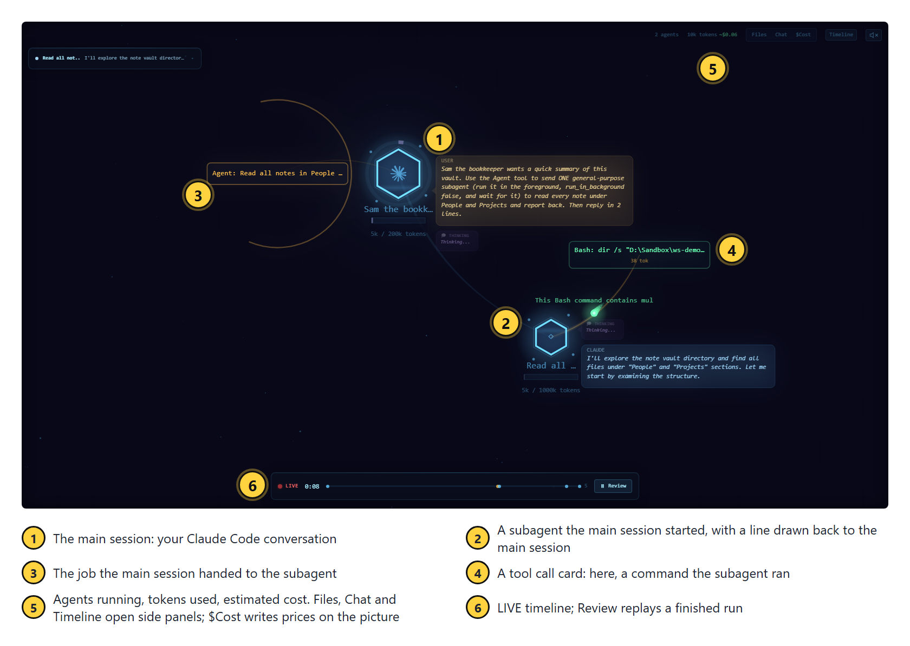

agent-flow only watches what your agents do; it cannot change what they do. (It does rewrite settings.json when it starts: see the security section below.)

### What it is for

Watching, as it happens, which subagents a Claude Code session starts and which files and commands it uses.

### Works well when

- **You are building an agent.** Its instructions say it calls 3 specialists. You run it with this screen open and see which specialists it really starts, in what order, and every file it really reads.
- **A session is slow or costing more than you expected.** You see the moment it starts 5 subagents at once, or reads the same file 4 times.
- **You are recording your screen** for a video, for a client, or for a live training you are running. Someone watching sees each subagent start, and each file it opens, as it happens.
- **You have just changed an agent's instructions** and want to watch the next run rather than read a summary of it afterwards.
- **You want to know why a session has gone quiet:** waiting on 1 slow command, or working through 6 subagents.

### Does not work well when

- agent-flow keeps nothing. The Review button replays only what the agent-flow program on your own computer is still keeping; stop that program and the record is gone for good. For a written trail of what each agent did, use ProjectForge, piece 3 of 4.
- **You want every session on 1 screen.** It draws 1 session per tab and you click between them. Ashley's attempt to merge them failed on 2026-06-12 (see How we built it). FleetView, piece 2 of 4, is the screen that does this.
- **You are screen-sharing or recording for other people.** Each tab is titled with the opening words of that session's prompt, and the cards beside each agent show your file names and commands. Check the tabs before you share.
- **You want to leave it running all day unwatched.** Our kit makes agent-flow refuse requests from other websites, but any program already running on your own computer can still open the page and read your conversation while agent-flow runs. Stop it when you are not watching: `python3 start.py --stop`.
- Do not install this piece if you do not want Node.js on your computer. agent-flow needs Node.js, and once agent-flow's small command has been added to Claude Code's settings file, every tool call starts Node.js once, even when the screen is off, until you uninstall.

## How we built it

This is how Ashley set agent-flow up on his own PC (not a Mac), what broke, and what we kept. Every date and count below was read from his files, settings backups and logs on 2026-09-22.


agent-flow is 1 of 4 screens Ashley built around his agents. The other 3 each have their own guide in this set of 4: FleetView, ProjectForge and Jeeves.


Claude Code lets you register a **hook**: a command it runs by itself every time a given event happens, such as "a tool is about to be used" or "a subagent has started". agent-flow registers a small script, `hook.js`, on 9 kinds of event. Each time 1 of them happens, Claude Code runs `hook.js` and hands it a description of the event. The script looks in the folder `<your home>/.claude/agent-flow/` for small files that say where the agent-flow server (the agent-flow program running in the background, which draws the page) is listening, and sends the event there. The server updates its picture and your browser redraws.

The page is drawn from 2 sources: the hook, and Claude Code's own session transcript files. The server reads Claude Code's own session transcript files, in `<your home>/.claude/projects/`, and that is where the tab title, the conversation in the Chat panel, the token counts and every subagent come from. The second hexagon, and the line joining it to the first, are drawn from the place in that transcript where the session starts the subagent, not from the "a subagent has started" event, which records only a name.


### 2026-06-12: install day

- Installed with npx, the downloader that comes with Node.js, and its `-y` option, which answers yes to the download question. `npx` comes with Node.js; it downloads a Node.js program and runs it in 1 go. On its first run the package wrote `hook.js` and added it to 9 kinds of event in Claude Code's `settings.json` file: SessionStart (a session opens), PreToolUse and PostToolUse (before and after each tool call), PostToolUseFailure (a tool call fails), SubagentStart and SubagentStop, Notification (Claude Code shows a message), Stop (Claude finishes a reply) and SessionEnd (a session closes).
- **Fix 1, the launch folder.** The server remembers the folder it was started from, and only accepts events from Claude Code sessions running inside that folder. Started from the wrong place, it shows nothing. So it was set to start from the Documents folder, which contains every vault.
- **Start by itself when the computer starts, with no window.** On his PC a small script file started it each time the computer started and he signed in. That file ran agent-flow through npx with the option `--no-open`, which stops it opening a browser tab.
- **Every session on 1 screen, tried and undone.** Ashley wanted every session on 1 screen instead of 1 tab each. We changed agent-flow's own code so it sent every session to the same screen. The data looked right, and it was reported as done without anyone looking at the screen. Ashley's reply: "that hasn't worked - It's not working at all." agent-flow's drawing code supports exactly 1 main hexagon per screen, so 6 main hexagons stacked on the same spot and their labels turned to nonsense. agent-flow was put back exactly as its author published it. Since then, every change to a screen is checked with a screenshot, never by reading the data behind it.
- The 1-screen wish went to a different tool, FleetView, which is piece 2 of 4.
- A backup of `settings.json` taken at 17:00 that day already had **5 copies** of the agent-flow hook on every event. The next day's backup had 4.

### Fix 2: old files pointing at servers that had stopped (date not recorded)

Each time the server starts it writes a small file into `<home>/.claude/agent-flow/`. Its name is a random code, a dash, the process number (the number the computer gives each running program), then `.json`, and inside it says which port that server listens on and which folder it watches. This guide calls those files **registration files**. The hook is meant to delete files for servers that have stopped. On Ashley's PC its "is this server still alive?" check always answered yes. Worse, when several files match a session's folder, the hook sends only to the server watching the **smallest** folder that contains the session (Documents/Second Brain is smaller than Documents, because it sits inside it). So if an old file names a server for a smaller folder, and that server has stopped, every event goes to it and is lost, the real server gets nothing, and the screen stays empty. The fix was to delete the old files and keep the file for the server that is running. 13 such files were still in that folder on 2026-09-22, dated 2026-06-12 to 2026-08-06. The kit you download does this clean-up before every start, on a Mac too.

### 2026-07-09 to 2026-09-16: the hook copies pile up

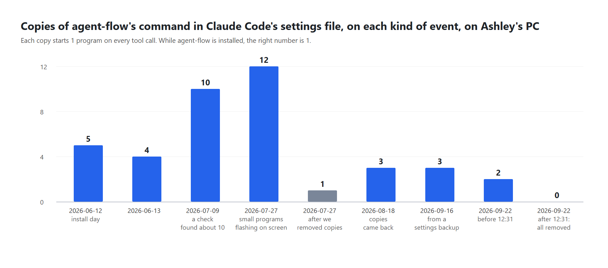

- **2026-07-09:** a check of the settings file found the hook registered about 10 times on every event.
- **2026-07-19:** `npx` downloaded the newer agent-flow, version 0.9.1.
- **2026-07-27:** Ashley: "Instances keep opening on my PC." The settings file had 112 hook entries in total; agent-flow's was on every event 12 times. Each tool call started about 27 small command-window programs, and each flashed a window on screen. Every hook was cut to 1 copy per event and command: 112 entries down to 13.
- **2026-08-18:** the copies had come back: 3 per event.
- **2026-09-16:** a backup shows 3 per event. On 2026-09-22 the file had 2 copies per event, and all of them were removed that day. No written record was found of the drop from 3 to 2.

At the time, why the copies piled up was not recorded. While building our download (the 5 Python scripts) on 2026-09-22 we read agent-flow 0.9.1's own set-up code and found a cause. Before adding its hook, agent-flow checks whether it is already there by searching your settings for the text `agent-flow/hook.js`, with a forward slash. On a PC the path it writes uses a backslash (`\`), so the search never matches its own entry, and **every time the server starts, it adds another copy to all 9 kinds of event**. We tested it on a PC in a test folder: 3 starts gave 3 copies per event. A server that starts by itself every time the computer starts, plus starts by hand during fixes, matches every rise in the chart. We cannot prove it was the only cause, because nobody logged each start.

On a Mac the path agent-flow writes already uses forward slashes, so its search finds its own entry: this pile-up is a PC fault (read from agent-flow's code; a Mac never showed it in our tests). Our installer still counts the hook on every event at every install and prints the count, so a second copy would show.

### The usage-tracking finding

agent-flow 0.9.1 sends anonymous usage events (an install code, its version, your operating system, session length) to a server run by its author, unless 1 of 2 switches is set before it starts: `AGENT_FLOW_TELEMETRY=false` or `DO_NOT_TRACK=1`. These are environment variables: settings a program reads from macOS when it starts. The GitHub page summary says tracking is off by default; the code switches it on. On Ashley's PC, 4 such events were logged between 2026-07-19 and 2026-08-06, because the file that started his agent-flow when his computer started set neither switch. Ours sets both, and `start.py` sets both every time it starts agent-flow, so tracking stays off even if you choose not to have that file.

### 2026-08-06: switched off

At 17:25 on 2026-08-06 the entry that started agent-flow each time Ashley's PC started was switched off, in the same minute as the FleetView dashboard. Who did it and why was not written down. A note Ashley wrote on 2026-09-22 says these screens were "stopped not deleted" when his work changed direction. The hooks were left in place, so every tool call still started Node.js (the program that runs agent-flow's scripts) once, found no server and quit. Our uninstall removes those hooks.

### 2026-09-22: what a security check of our own kit found

Before this guide went out, our 5 Python scripts (the kit you download) were tested by someone trying to break them, using the real agent-flow in a test home folder. 3 faults were found and all 3 are fixed in the version you download. A 4th, found on 2026-09-24, is the last item below, and it is fixed too.

- **agent-flow could wipe your Claude Code settings when it starts by itself.** agent-flow runs its own set-up every time it starts. If it cannot read `settings.json`, it throws the whole file away and writes a new one containing only its 9 hooks: your permission rules, your blocked commands, your model choice and every other hook, gone, with no backup. 2 ordinary slips make the file unreadable to it: a comma after the last item (easy to leave after a hand edit), and an invisible marker at the very start of the file called a byte-order mark, which some editors add when they save. With agent-flow starting by itself each time you switch on your Mac and sign in, that would happen the next time you did, with nothing on screen to tell you. **Our fix:** `start.py` now checks the file before every start and does not start agent-flow if the file is unsafe; it says why on screen and in `logs/start.log`. There is also a second check: a new file, `guard.py`, keeps an exact copy of your settings before agent-flow starts, watches the file for the first 60 seconds, and puts your copy back if agent-flow changed it. Tested with the real agent-flow: with a comma after the last item, or with a byte-order mark, your settings file is left exactly as it was, character for character.
- **Stop could close an unrelated program.** `start.py --stop` used to stop whatever program had the process number saved when agent-flow last started. After a restart, the computer can give that number to any program, including Claude Code or your browser. **Our fix:** the saved record now includes the moment the program started, and stop only acts when both match.
- **Other websites could read the page.** agent-flow's page shows your conversation as it happens: your prompts, Claude's replies, file names and commands. It answers every request that reaches it, and never checks which website the request came from. A website you visit can trick your browser into sending its requests to your own computer, and then read your conversation while you browse. **Our fix:** agent-flow now serves its page on a private port, a number picked at random at each start, and `guard.py` passes that page to you at http://127.0.0.1:3001. `guard.py` answers only requests addressed to this computer (`127.0.0.1`, `localhost` and `[::1]` are 3 ways of writing "this computer"). Anything else is refused.
- **agent-flow's own 2 ports were still open (found and fixed on 2026-09-24).** `guard.py` guarded only port 3001. In a test with the real agent-flow, a request sent straight to the private port, naming another website as its address, got the page and the live conversation back. The port that receives events from `hook.js` also took a made-up event sent with another website's name on it, and drew it on the screen. **Our fix:** `guard.py` now starts agent-flow with our small file `only_this_computer.js` loaded first (Node.js's `--require` option runs a file before the program itself). It makes both of agent-flow's ports refuse any request that names another website or was sent from one. agent-flow's own files are unchanged. The same test run again: every request from the made-up website was refused (5 of 5), and events from `hook.js` still reached the page.

> **Warning:** 2 limits remain. First, the checks work only when our kit starts agent-flow (`python3 start.py`, or our LaunchAgent, a small file that tells your Mac to start agent-flow when you switch on your Mac and sign in). A copy started by hand with `npx agent-flow-app` has none of them. Second, any program already running on your own computer can still open the page, as with every page at 127.0.0.1. If you are not watching agent-flow, stop it with `python3 start.py --stop`.


### What we kept for you

- agent-flow exactly as its author published it, downloaded by your own computer from npm. We changed none of its code.
- The hook entry in settings.json written with forward slashes (/), so agent-flow recognises it and never adds another copy.
- A LaunchAgent (a small file in `~/Library/LaunchAgents` that tells your Mac to start 1 program each time you switch it on and sign in) that starts agent-flow with no window, from the folder that contains your vaults, with usage tracking off.
- `cleanup.py`, which deletes the registration files a stopped agent-flow server left behind saying where it was listening, and ends a second server left watching the same folder, run automatically before every start.
- `check_hooks.py`, a count of every hook on every event.
- `guard.py`, which puts settings.json back if agent-flow wipes it and refuses page requests from other websites (both found when we tried to break the kit on 2026-09-22).
- `only_this_computer.js`, which `guard.py` loads into agent-flow so that agent-flow's own 2 ports refuse other websites too (added 2026-09-24).
- If the computer hands agent-flow's private port to another program in the moment before agent-flow takes it, `guard.py` picks another number and tries again, up to 3 times (1 start in 34 failed this way on a PC on 2026-09-22).
- A start that fails now tells you why in 1 sentence, instead of pointing you at a log full of Node.js text (added 2026-09-23. On 2026-09-22 we started agent-flow 34 times in a row; 1 start failed, and the message it printed could not be read).

## Pros and cons

| | Pros | Cons |
|---|---|---|
| Cost | Free, with its code open to read. Uses no Claude tokens itself. | Every tool call starts Node.js once, to run `hook.js`, and Claude Code waits for it to finish each time: about 0.05 seconds on Ashley's own PC on 2026-09-24 (not measured on a Mac), and never more than 1.5 seconds, because `hook.js` ends itself by then. It does this even when the server is off, until you uninstall. |
| Setup | About 1 minute with our installer, plus the first download. | Needs Node.js 22 or newer. |
| What you see | A subagent appears within a second of starting, read from Claude Code's own session transcript file; every tool call is a card beside the agent that made it; the Review button at the bottom of the page replays a finished run. | 1 session per tab. There is no single screen with every session: our 2026-06-12 attempt to add that screen failed. FleetView (piece 2 of 4) is that screen. |
| Accuracy | Tool calls come straight from Claude Code's own events; subagents, the conversation and the token counts are read from Claude Code's session transcript files. | Token counts and costs are estimates. On Ashley's PC they disagreed with FleetView (the session-and-cost screen in piece 2 of 4) for the same session. |
| Privacy | agent-flow listens only on your own computer, and our kit makes all 3 ports (the page at 3001, which is `guard.py`'s, and agent-flow's own 2: its private page port and the port that receives events) refuse requests from other websites. | Tab titles show the first words of your prompts, so take care when screen-sharing. agent-flow's own usage tracking (it sends anonymous usage figures to its author) is on unless switched off, and `start.py` switches it off every time it starts agent-flow, whether you start it by hand or it starts by itself when you switch on your Mac and sign in. A copy of agent-flow started by hand, without our kit, has none of these checks. |
| Safety | Our kit will not start agent-flow on a settings file it would wipe, and puts the file back if it changes anyway. | agent-flow still runs its own set-up every time it starts. Our checks run before and after that set-up; they cannot stop it happening. |
| What the kit does before every start | The faults Ashley met on his PC are dealt with before every start: agent-flow is started from your watch folder, leftover registration files are deleted, and the hook is counted on every event at every install. Closing agent-flow by force (Force Quit, or a crash) used to leave a second server running and sending the same events twice; `cleanup.py` now counts how many agent-flow servers are running, instead of how many folders are being watched, ends the extra server, and prints a line saying it did. | agent-flow's own registration files are still written by agent-flow, so a server closed by force leaves its file behind until the next `python3 start.py` or `python3 cleanup.py`. |


## Before you start

### Before you start on a Mac

**Python.** Install Python from https://www.python.org/downloads/macos/ (the link labelled "macOS installer"; we tested 3.14.7). When it finishes, double-click **Install Certificates.command** and **Update Shell Profile.command** in the Python folder inside Applications, then open a new Terminal window. Check with `python3 -c "import sys; print(sys.prefix)"`: it should print a line starting `/Library/Frameworks/Python.framework`. If it starts `/opt/homebrew` or `/usr/local/Cellar`, your Terminal uses Homebrew's Python (Homebrew is an add-on installer many Mac owners use). Every command here still works. The self-checks run from a private Python folder: a folder in your home folder with its own copy of Python's add-ons, which works with python.org's Python and with Homebrew's.

**Node.js.** Install the LTS version (long-term support: the version that gets security fixes the longest) from https://nodejs.org (we tested v24.21.0), open a new Terminal window, and check with `node --version`: `v22` or higher.

**The first time you type `git`.** Your Mac may show a box asking to install the command line developer tools. Press Install, wait until it has finished, then type the `git` line again.

**If Terminal says `claude` is not found,** type the line below. It adds the folder Claude Code is installed in to the list of folders Terminal looks in for programs. Then open a new Terminal window and check with `claude --version`.

```
echo 'export PATH="$HOME/.local/bin:$PATH"' >> ~/.zshrc
```

**Your second brain** is at `~/Second Brain` on a Mac, a folder in your home folder, not in Documents, because macOS can stop a program that starts by itself from opening your Documents folder. If a page says "macOS refused access to" a folder, move that folder into your home folder and run `python3 install.py` again.

**"Allow Python to find devices on local networks?"** If macOS asks this the first time the page opens, press Allow.

**Apple Silicon or Intel** (the 2 kinds of chip a Mac can have; the Apple menu, then About This Mac, shows yours): the steps are the same on both, and both were tested.

**Tried only on test Macs.** Every step above was tried only on test Macs (Macs GitHub rents out by the minute to run scripts, not a person's own Mac), never on a real Mac. 3 of them cannot happen on a test Mac, so they were not tried at all: the developer-tools box, macOS stopping a program from opening Documents, and the question about devices on local networks.

### What to check

| You need | How to check | If it is missing |
|---|---|---|
| Claude Code | `claude --version` | You have it from earlier Outliers Accelerator sessions. If Terminal says `claude` is not found, see "Before you start on a Mac" above. |
| Python 3.11 or newer | `python3 --version` | python.org, as above. `install.py` tests this and stops if it is older, because Python 3.8 stopped getting security fixes on 2024-10-07 and Python 3.10 gets them only until 2026-10-31. |
| Git | `git --version` | The first time, your Mac may offer to install the developer tools: see above. |
| Node.js 22 or newer | `node --version` | The LTS version from nodejs.org, as above (LTS means long-term support, the version that goes on getting security fixes longest). Node.js 18 stopped getting security fixes on 2025-04-30 and Node.js 20 on 2026-04-30, so `install.py` stops on anything below 22. Then open a NEW Terminal window, because a window opened before the install cannot find Node.js. |
| Port 3001 free (the number the page answers on) | Open http://127.0.0.1:3001 in a browser; it should fail to load | Install with `python3 install.py --port 3002` instead, then use 3002 wherever this guide says 3001. |

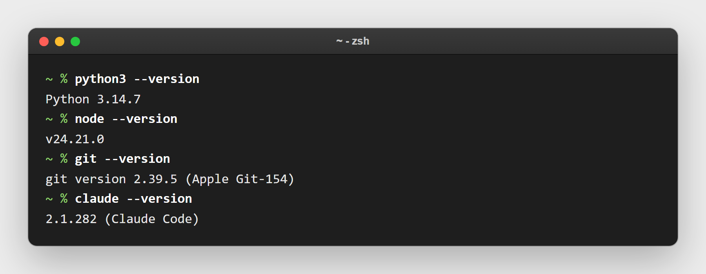

You also need to know where your second brain vault and your CRM vault live. The installer finds them for you in 1 of these ways: small files called `.outliers-sb` and `.outliers-crm` in your home folder, each containing the path to 1 of your vaults (the installers from earlier Outliers Accelerator sessions left them there), a folder with an `.obsidian` folder inside it (that is what makes a folder an Obsidian vault) up to 2 levels under your home or Documents folder, or, for the CRM, a vault whose name contains crm, pipeline, sales or clients, or a folder called `CRM` in your home folder (`~/CRM`).

## Install it

1. Open Terminal: press Command and Space together, type `Terminal`, press Return. It opens in your home folder, which is where all 4 downloads in this set go.
2. Type these 3 lines, 1 at a time, pressing Return after each:

```
git clone https://github.com/OUTLIERS-ai/outliers-ws-01-agent-flow-mac
cd outliers-ws-01-agent-flow-mac
python3 install.py
```

   Keep the folder where it lands: the LaunchAgent that starts agent-flow when you switch on your Mac and sign in points at it.
3. Answer 3 questions. Press Return to accept the suggestion in square brackets.
   - Where is your second brain vault?
   - Where is your CRM vault?
   - Which folder should agent-flow watch? It suggests the folder that contains both vaults. It must contain every folder you run Claude Code in, or those sessions will not show.

   If a question shows no suggestion, paste the full path of that vault (in Finder, right-click the folder, press the Option key, and choose Copy as Pathname while it is down). If your CRM from the CRM sessions is at `~/CRM`, the CRM question suggests that folder: press Return to accept it. No CRM vault yet? That question then shows no suggestion; press Return to leave it blank, and the watch folder suggested is still your home folder, so a CRM you add there later still shows. (What Return does at each question was checked on a test Mac on 2026-09-25.)
4. Wait for the first run. The installer downloads agent-flow and starts it once, with no window, pointed at a temporary empty folder that stands in for your home folder, so it writes its own `hook.js` without touching your settings. It copies that script into your `.claude/agent-flow` folder and stops it. This can take up to 3 minutes on a slow connection. You do not need an account or a password for this step.
5. Read the table the installer prints at the end: 1 row per kind of event. Every event should show `1` in the "after" column. If you had old copies, the "before" column shows how many, and a dated backup of your settings is named on screen. Last, it writes the LaunchAgent that starts agent-flow when you switch on your Mac and sign in, `~/Library/LaunchAgents/com.outliers.agent-flow.plist`, and says it takes effect the next time you do.

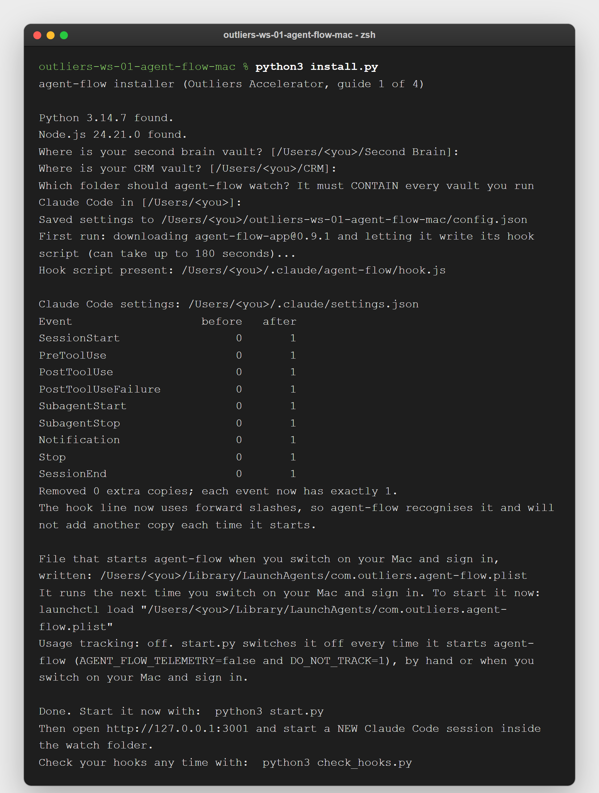

6. Start it now: `python3 start.py`. The installer also prints a line that starts it with launchctl; you do not need to type that line, because `python3 start.py` starts agent-flow straight away. From then on it also starts by itself, with no window, each time you switch on your Mac and sign in.
7. Open http://127.0.0.1:3001. In the middle of the page you see "WAITING FOR AGENT SESSION" in capitals, and under it "Start a Claude Code session to see activity".


8. Open a **new** Claude Code session inside 1 of your vaults. Sessions that were already open show nothing, because Claude Code reads hooks only when a session starts. Ask it for something that uses a subagent, for example: "Use a subagent to list the notes in my People folder, then summarise them in 2 lines." A hexagon appears, then a second hexagon with a line to it. Nothing after 30 seconds? Check the session was started AFTER step 6 and inside the watch folder shown by `python3 start.py --status`, then see the "When it goes wrong" table at the end of this guide.

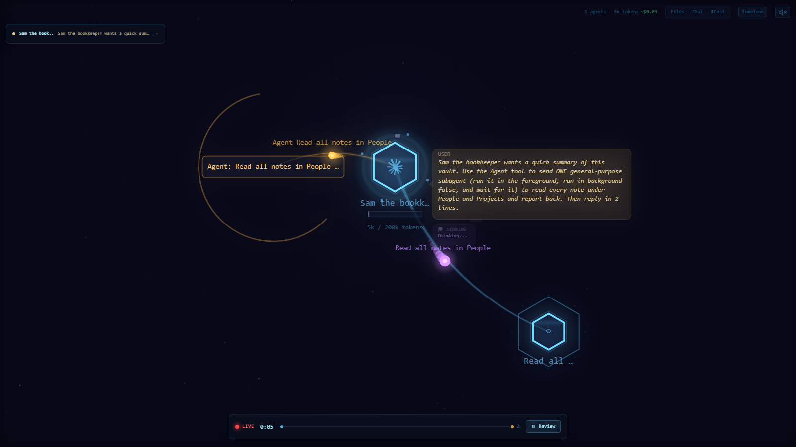

9. Run `python3 check_hooks.py`. It should end with `RESULT: OK`.

> **Tip:** to remove everything later, run `python3 install.py --uninstall`. It stops the server, takes a backup, removes every agent-flow hook entry, and deletes the LaunchAgent that starts agent-flow when you switch on your Mac and sign in. Your settings go back to exactly how they were, character for character, as long as the backup from your first install is still there. If you had no settings file before, an empty settings file (containing only `{}`) is left. The folder `~/.claude/agent-flow` stays; you may delete it by hand.

## Using it day to day

Every command below runs inside the downloaded folder. In a new Terminal window, type `cd outliers-ws-01-agent-flow-mac` first.

- **Leave the page open in a browser tab** while you work. Switch tabs at the top to follow a different session.
- **Press Review** on the bottom bar to replay a run that has finished.
- **The Files, Chat and Timeline buttons** top right open side panels: which files were touched, the conversation, and a timeline of every call.
- **The $Cost button** beside them opens no panel. It writes an estimated price above each hexagon and draws a small cost box in the corner of the picture, split by agent and by tool. Nothing appears until a session has used enough tokens for the estimate to come to more than $0.00.
- **Check your hooks once a week:** `python3 check_hooks.py`. Anything other than 1 per event means something else has been writing to your settings.
- **If the page goes quiet:** run `python3 start.py --stop`, then `python3 start.py`, then open a new Claude Code session.
- **If a start fails,** it now tells you why in 1 sentence on screen: the port was taken, the internet is not reachable and agent-flow is not saved on this computer yet, Node.js is missing or too old, or the package name in `config.json` is wrong. `python3 start.py --status` repeats that sentence later.
- **Stopping:** `python3 start.py --stop` says "Stopped agent-flow." or "agent-flow was not running. Nothing to stop." Check any time with `python3 start.py --status`.
- **If you move your vaults**, run `python3 install.py` again and give the new watch folder. The suggestions in square brackets are your OLD paths, so type the new ones for each vault and for the watch folder. If the server was running, the installer stops it and starts it again for the new folder. If you once chose `--no-autostart`, running the installer again without it keeps that choice, because it is saved in `config.json`; `python3 install.py --autostart` switches starting by itself back on.
- **Screen-sharing:** close the tab or pick a demo session first. Tab titles show the start of your prompts.
- **When you are not watching,** stop it with `python3 start.py --stop`. While it is stopped, no website can reach the page.

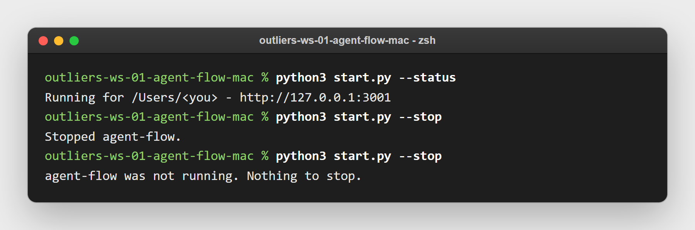


## Fit it to your own AI system

**The safe way.** Make your changes in a copy of the folder, called `agent-flow-test`, never in the folder you installed. In the copy, run only the self-checks. Never run `install.py` or `start.py` in the copy: both act on the same settings file, the same LaunchAgent that starts agent-flow when you switch on your Mac and sign in, and the same running agent-flow as your everyday folder, so the copy would take them over. The self-checks are safe while your everyday agent-flow is running: they use a made-up home folder and a stand-in for agent-flow, never your real settings or port 3001.

1. Make the copy. Open a new Terminal window (it opens in your home folder, where the download is) and type:

```
cp -R outliers-ws-01-agent-flow-mac agent-flow-test
```

2. Go into the copy and delete its `logs` folder, which contains the record of your running agent-flow. If there is no `logs` folder, the second line does nothing:

```
cd agent-flow-test
rm -rf logs
```

3. Once, first, make a private Python folder for the self-checks and install pytest into it (pytest is the program that runs the self-checks; the private folder, `~/outliers-checks`, works whichever Python your Mac uses). In the second line, the part before `&&` switches this Terminal window into the private folder, so the `python` after it is the folder's own copy:

```
python3 -m venv ~/outliers-checks
source ~/outliers-checks/bin/activate && python -m pip install pytest
```

4. In the copy, run the self-checks after every change:

```
source ~/outliers-checks/bin/activate && python -m pytest -q
```

   Expect `54 passed, 5 skipped`. 4 of the skipped run only against the real agent-flow package, which the checks do not download; they stay skipped unless you set `AGENT_FLOW_REAL=1`, an environment variable (a setting a program reads when it starts; see "Worth knowing"). The 5th checks a path only a PC uses. Any other answer means the change broke something, so put it back before you go on.
5. When a change passes, copy the changed files back into your everyday folder, `outliers-ws-01-agent-flow-mac`. Go into it with `cd ../outliers-ws-01-agent-flow-mac`, then run `python3 start.py --stop`, then `python3 start.py`, then `python3 check_hooks.py`, and expect `RESULT: OK`. If you changed `install.py`, run `python3 install.py` there before `python3 start.py`.

Read "Every command and setting" near the end of this guide before you ask Claude Code for a change: the watch folder, the port and whether agent-flow starts by itself when you switch on your Mac and sign in are already settings in `config.json`. Leave 1 line alone: the agent-flow hook line inside Claude Code's own `settings.json`. Never type that line by hand; `python3 install.py` writes it, and `python3 check_hooks.py` proves there is still exactly 1 copy of it on each event.

Ashley changed his own copy. He tried patching agent-flow to put every session in 1 tab, looked at the screen, saw 6 sessions stacked on the same spot, and threw the patch away. He worked out 2 fixes on his own PC himself: start the server from the folder that sits above all your vaults, or it never hears your sessions; and delete the leftover registration files, or events stop arriving with no warning. His own file that started agent-flow with no window each time his PC started left usage tracking on; ours switches it off. He added a count of hooks after his own settings file reached 12 copies of the same hook on every event. The download you have contains both fixes and the hook count.

Each idea below comes with a prompt you can paste into Claude Code, opened in the `outliers-ws-01-agent-flow-mac` folder unless it says otherwise: in a new Terminal window, type `cd outliers-ws-01-agent-flow-mac`, then `claude`.

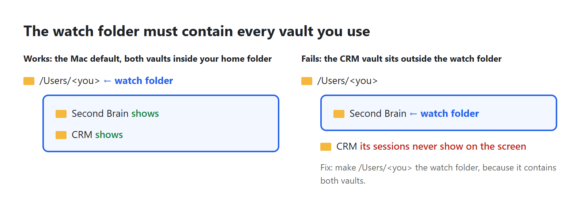

1. **See your second brain AND your CRM in 1 place.** The server only hears sessions inside its watch folder. On a Mac your second brain is at `~/Second Brain` and your CRM at `~/CRM` unless you chose otherwise, so the only folder containing both is your home folder, which is what the installer suggests. If you keep a vault anywhere else, check that it sits inside the watch folder.

```
Read config.json. Tell me whether my second brain vault and my CRM vault are both inside watch_folder. If not, run install.py again with --watch-folder set to the nearest folder that contains both, and show me the before and after.
```

2. **Watch your content system write a batch of posts.** Run whatever agents or scripts write your posts from a folder inside the watch folder, open agent-flow, and start a batch. You will see which steps start subagents and which are commands Claude runs, each shown as a card.

```
The agents or scripts that write my posts live at <path>. Check whether that folder is inside the watch_folder in config.json. If it is not, tell me the smallest change: move the folder, or widen the watch folder. Do not move anything without asking.
```

3. **Check an agent you are building really does what its instructions say.** Open the agent's file, list what it claims to call, run it with agent-flow open, and compare.

```
Read ~/.claude/agents/<agent-name>.md. List every subagent, tool and file it says it uses, as a checklist. I will run it now with agent-flow open and tell you what cards appeared. Then mark each checklist line as seen, not seen, or seen but not listed.
```

4. **Give every subagent a real name.** If your session starts a subagent that is not one of the named agents in your agents folder (`~/.claude/agents`, where each agent has its own file), it is labelled with the first words of the job it was given, such as "Read all ...", instead of an agent's name. Named agents make the picture readable.

```
Search my second brain's CLAUDE.md and my agent files for places that start a subagent with a generic type such as general-purpose. List each one and suggest which named agent from ~/.claude/agents/ should be used instead. Change nothing yet.
```

5. **Keep a permanent log.** agent-flow keeps no history once the server stops. Add a second, separate hook that appends each event to a dated file, then summarise a day into your second brain.

```
Add 1 NEW hook to my Claude Code settings.json on SubagentStart and SubagentStop that appends the event as 1 JSON line to ~/.claude/agent-events/YYYY-MM-DD.jsonl. Use a Python script run with python3. Take a dated backup of settings.json first, write it with a temp file and os.replace, and run python3 check_hooks.py afterwards to prove every event still has 1 copy of each command.
```

6. **Stop Node.js starting for nothing when the server is off.** If you only use agent-flow sometimes, every tool call still starts Node.js for nothing. Remove the hooks when you stop, and put them back when you start.

```
Write stop_all.py and start_all.py in this folder. stop_all.py runs start.py --stop and then removes the agent-flow hooks using common.remove_agent_flow, with a backup. start_all.py puts the hooks back with common.install_agent_flow and runs start.py. Add tests using a temporary home folder, like the ones in tests/, and run them in my private Python folder ~/outliers-checks.
```

7. **Run it only when you want it.** Skip the LaunchAgent that starts agent-flow when you switch on your Mac and sign in, and start it by hand instead. `--no-autostart` also removes the LaunchAgent if you already have it. The choice is saved in `config.json`, so running `python3 install.py` again later keeps it; `python3 install.py --autostart` puts the LaunchAgent back.

```
Run python3 install.py --no-autostart and check that ~/Library/LaunchAgents/com.outliers.agent-flow.plist is gone. Then make 2 files on my Desktop that I can double-click: "Agent screen.command", which runs python3 start.py in this folder, and "Stop agent screen.command", which runs python3 start.py --stop. Make both runnable with chmod +x and show me their contents.
```

8. **Capture footage for content.** Record the page while several agents are working at once: it gives you a short video of "the agents working" to use in a post.

```
Write capture.py: open http://127.0.0.1:3001 in headless Playwright at 1600 by 900, take a screenshot every 2 seconds until I press Ctrl+C, and save them numbered into a folder called captures with today's date. No visible browser window.
```

9. **Weekly hook check without a window.** Run the duplicate check once a week, with no window, and write the result into your second brain's inbox only when something is wrong. `check_hooks.py` ends with exit code 1 when it finds a duplicate and 2 when settings.json cannot be read (an exit code is the number a program hands back when it finishes; 0 means all well).

```
Make a LaunchAgent that runs check_hooks.py with python3 once a week on Monday at 09:00, with no window (use StartCalendarInterval). If the exit code is 1 or 2, write a short note into <second brain>/Inbox/ named YYYY-MM-DD hook check.md with the output. Do not run it more often than weekly.
```

## Every command and setting

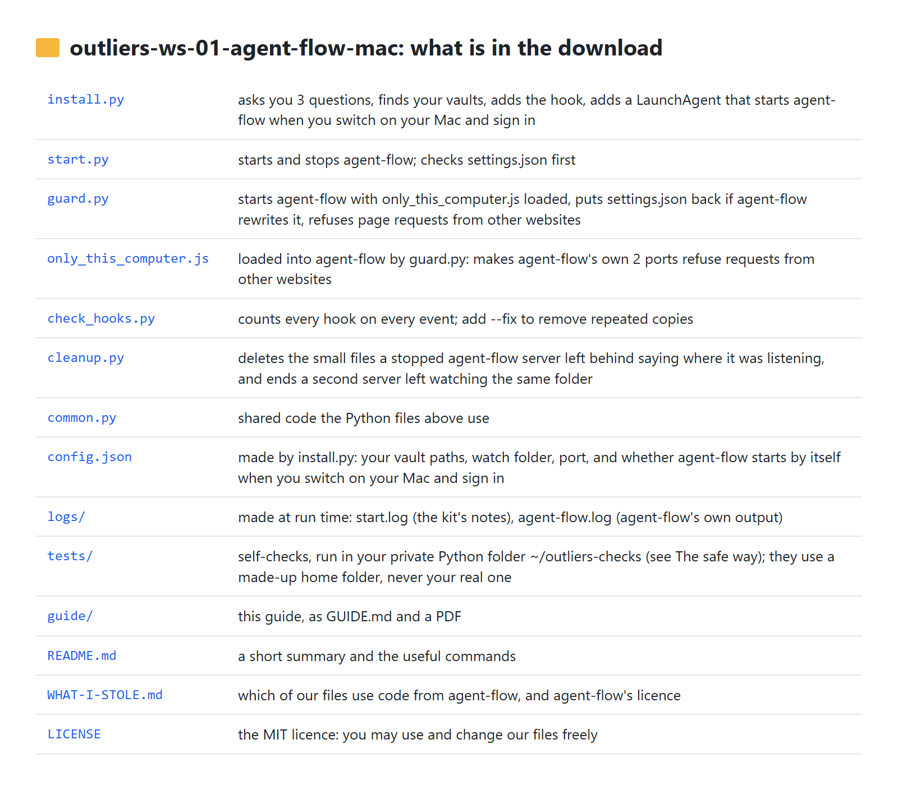

**install.py** (every option can be combined with the others, except `--autostart` with `--no-autostart`)

| Option | What it does |
|---|---|
| (none) | Asks you 3 questions, then installs. |
| `--yes` | Accepts every suggestion without asking. |
| `--second-brain <path>`, `--crm <path>` | Gives the vault paths instead of answering the questions. |
| `--watch-folder <path>` | Sets the watch folder and skips the 3 questions. The installer warns you if a vault is not inside it. |
| `--port <number>` | The page's port (default 3001). A running server is moved to the new port. |
| `--no-autostart` | Does not add the LaunchAgent that starts agent-flow when you switch on your Mac and sign in; also removes it if you already have it. The choice is saved in `config.json`, and later runs of `install.py` keep it. |
| `--autostart` | Puts that file back after an earlier `--no-autostart`, and saves that choice instead. |
| `--start-now` | Starts the server at the end, so you can skip step 6. |
| `--uninstall` | Stops the server, removes every agent-flow hook (backup first) and the LaunchAgent that starts agent-flow when you switch on your Mac and sign in. |
| `--package`, `--node-path`, `--wait` | Advanced and for testing. `--package`: which agent-flow version to run (default `agent-flow-app@0.9.1`). `--node-path`: which copy of Node.js the hook should use. `--wait`: how many seconds to wait for the first download (default 180). |

**start.py**

| Option | What it does |
|---|---|
| (none) | Checks settings.json, deletes leftover registration files, starts agent-flow with no window, prints the address. |
| `--stop` | Stops the server this kit started. |
| `--status` | Says "Running" or "Not running", and if the last start was refused or failed, the 1-sentence reason. Exit code 0 when running, 1 when not. |
| `--port`, `--watch-folder`, `--package`, `--wait` | Override `config.json` for this run only. |
| `--foreground`, `--quiet` | Used by the LaunchAgent that starts agent-flow when you switch on your Mac and sign in. `--foreground`: stay running until agent-flow stops, instead of handing your terminal straight back, which the LaunchAgent needs. `--quiet`: print nothing at all. |


**check_hooks.py**: `--fix` keeps 1 copy of each repeated hook after a dated backup; `--settings <file>` checks a different settings file. Exit codes: 0 all well, 1 duplicates found, 2 the file cannot be read.

**cleanup.py**: `--dry-run` only reports what it would delete or end; `--quiet` prints nothing. It removes registration files for servers that have stopped, and when 2 servers are watching the same folder (what closing agent-flow by force leaves behind) it ends the older server and takes its file away.

**Files the kit makes while it runs**

- `config.json`: your 2 vault paths, the watch folder, the agent-flow version, the port and whether the LaunchAgent that starts agent-flow when you switch on your Mac and sign in is switched on (later runs of `install.py` keep that answer unless you add `--autostart` or `--no-autostart`). `config.example.json` shows what the file looks like.
- `logs/start.log`: the kit's own notes, such as a refused start or a settings file put back.
- `logs/agent-flow.log`: agent-flow's own output. `start.py` reads its last 30 lines to work out the 1-sentence reason it prints when a start fails; open it yourself for the full text.
- `logs/agent-flow.pid` (PID stands for process ID, the number the computer gives a running program): the number and start time of `guard.py`, which runs agent-flow, so `--stop` finds it and nothing else.
- Settings backups next to `settings.json`: `settings.json.bak-agent-flow-<date>` (before install), `.bak-agent-flow-uninstall-<date>` (before an uninstall), `.bak-hookdedupe-<date>` (before `--fix`) and `.bak-agent-flow-undo-<date>` (agent-flow's rewritten version, kept when `guard.py` put yours back).
- The LaunchAgent that starts agent-flow when you switch on your Mac and sign in: `~/Library/LaunchAgents/com.outliers.agent-flow.plist`. It takes effect the next time you switch on your Mac and sign in; until then, start agent-flow with `python3 start.py`. To see whether it is running (each line is 1 program your Mac started; the name ends `com.outliers.agent-flow`):

```
launchctl list | grep outliers
```

**Worth knowing**

- If you set `CLAUDE_CONFIG_DIR` (a setting that tells Claude Code to keep its settings in a different folder), the installer uses that folder. agent-flow itself always uses `<home>/.claude`, so it will not find your session transcripts and you get a half-drawn page. See the "Half a page" row of "When it goes wrong".
- agent-flow also watches OpenAI Codex (OpenAI's coding assistant) unless the environment variable `AGENT_FLOW_RUNTIME=claude` is set. It does no harm if you do not use Codex.
- The kit's automatic self-checks run in your private Python folder, `~/outliers-checks`, with the lines in steps 3 and 4 of "The safe way" above. They use a made-up home folder and a stand-in for agent-flow, so your real settings are never touched; 6 of them need Node.js, which this piece needs anyway. 4 more checks run against the real agent-flow if you first set the environment variable `AGENT_FLOW_REAL=1`; without it those 4 are skipped, and 1 more is skipped on a Mac because it checks a path only a PC uses. Measured on 2026-09-25 on GitHub's test Macs: 54 passed, 5 skipped.

## When it goes wrong

| What you see | Why | Fix |
|---|---|---|
| The page says "WAITING FOR AGENT SESSION" forever | The session was already open when the server started, or it runs outside the watch folder. | Open a NEW session inside the watch folder. Check the folder with `python3 start.py --status` and `config.json`. |
| Half a page: tool call cards appear, but no subagent hexagons, the tab is titled `Session` and a number instead of your prompt, and the token count stays at 0 | You have set `CLAUDE_CONFIG_DIR` to keep Claude Code's folder somewhere other than `<home>/.claude`. The hook still reaches agent-flow, but agent-flow reads session transcripts only from `<home>/.claude/projects/`, and yours are not there. | Start Claude Code without `CLAUDE_CONFIG_DIR`, or move the folder back to `<home>/.claude`. agent-flow cannot be pointed anywhere else; the folder is written into its code. |
| Still nothing after a new session | A leftover file from an old agent-flow server, pointing at a folder deeper inside your watch folder, is taking the events (seen on Ashley's PC). | `python3 cleanup.py`, then `python3 start.py --stop` and `python3 start.py`, then a new session. |
| "agent-flow was NOT started, to protect your Claude Code settings" | settings.json has a typing error, or an invisible marker at its very start that some editors add (a byte-order mark); agent-flow would have replaced the whole file. | Error with a line number: open settings.json at that line, fix it (a comma after the last item is the usual cause), save. Byte-order mark: run `python3 install.py`, which removes it after a backup. Then `python3 start.py`. |
| The page never loads after you switch on your Mac and sign in | The settings check refused to start agent-flow when you signed in, or the start failed, and nothing was on screen to tell you. | `python3 start.py --status` prints the 1-sentence reason; fix as it says, then `python3 start.py`. |
| "agent-flow did not start", then a sentence | The start failed. The sentence names the cause: the port was taken, the internet could not be reached and agent-flow is not saved on this computer yet, Node.js is missing or too old, or the package name in `config.json` is wrong. | Do what the sentence says. For a taken port, run `python3 start.py` again. `logs/agent-flow.log` has the full text if you want it. |
| "Ended 1 agent-flow server(s) left behind when the last one was closed by force" | agent-flow was closed by force (Force Quit, or a crash), or the Mac shut down without `python3 start.py --stop`, so agent-flow outlived the program that started it. | Nothing to do. It has already been ended. Use `python3 start.py --stop` rather than Force Quit and it will not happen again. |
| "Port 3001 is already in use" | Another program uses that port. | `python3 install.py --port 3002`, then `python3 start.py`, then open http://127.0.0.1:3002. |
| The installer stops: Node.js not found | Node.js is not installed, or the terminal was opened before installing it. | Install it (see Before you start), open a NEW terminal, run again. Nothing was changed. |
| The installer stops: could not read settings.json | The file has a typing error in it. `check_hooks.py` shows the same fault with the line and column. | Open settings.json at that line, fix the error, run again. Your Claude Code settings were not changed. |
| `check_hooks.py` says settings.json is empty | The file is there but has nothing in it. agent-flow cannot read an empty file, so at its next start it would replace it with a file that has only its own 9 hooks in it. `start.py` refuses to start it for the same reason. | `python3 install.py`. It writes the 9 hooks into the file properly, after a backup. |
| A file called `settings.json.bak-agent-flow-undo-<date>` appeared | agent-flow rewrote your settings after starting and `guard.py` (our program between agent-flow and your browser) put your version back. The file is agent-flow's version, kept for you to look at. | Nothing to do. `logs/start.log` records when it happened. |
| The token count and the cost on this page do not match the ones on another screen, such as FleetView | agent-flow's token and cost figures are estimates. | Treat them as a rough guide. They are not a bill. |
| A change you made to the screen "should work" but looks wrong | The change was checked by reading the numbers behind the picture instead of looking at the picture. On 2026-06-12 our attempt to show every session on 1 screen had the right data while the screen showed 6 hexagons stacked on 1 spot. | Take a screenshot and look at it before calling it done. |


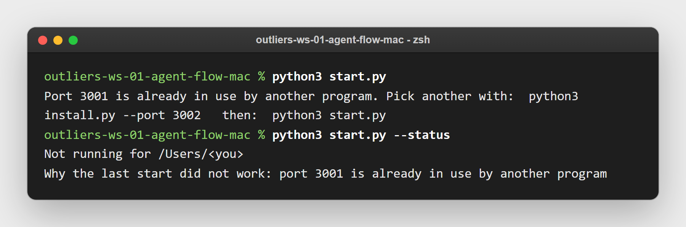


> **Warning:** do not run `npx agent-flow-app` by hand while this kit is installed. You get 2 servers. Your sessions report to only 1 of them, the one watching the folder nearest to the session, and a copy started by hand runs without our settings check, so it can throw away settings.json. Use `python3 start.py` instead.

## Download

The repository: https://github.com/OUTLIERS-ai/outliers-ws-01-agent-flow-mac

```
git clone https://github.com/OUTLIERS-ai/outliers-ws-01-agent-flow-mac
cd outliers-ws-01-agent-flow-mac
python3 install.py
```

Then `python3 start.py` and open http://127.0.0.1:3001.

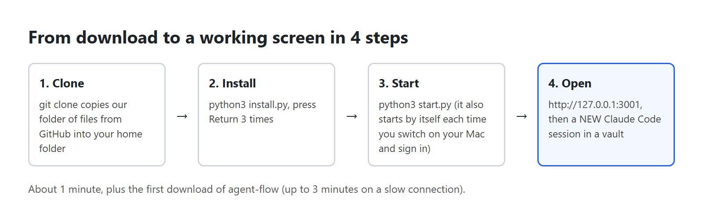

agent-flow itself: github.com/patoles/agent-flow (Apache 2.0 licence). Our files: MIT licence. Both are free licences: you may use and change the code.
